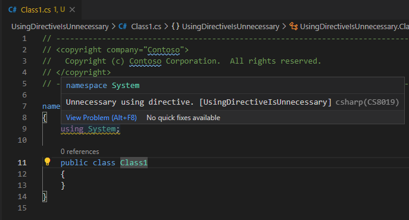
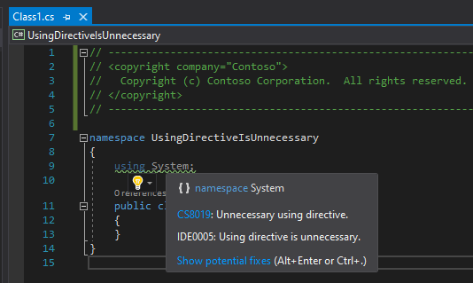

# .NET Analyzers Repro

The purpose of this repo is to demonstrate some oddities in the .NET 5 analyzers.

## Requirements

* .NET 5 SDK (5.0.202-ish)

I've only tested these on Windows. I don't know if they repro on Linux or macOS.

## Repro projects

### RepeatBuildOmitsWarnings

The purpose of this project is to demonstrate that the first build will produce warnings or errors from rules configured
in the [.editorconfig](./.editorconfig), but a subsequent build will succeed without any warnings or errors.

#### Warnings omitted on subsequent build

Repro instructions from the root of this repository:

```shell
cd /RepeatBuildOmitsWarnings
dotnet build
dotnet build
dotnet clean
dotnet build
```

The output of the first `dotnet build` emits the following output with 2 warnings:

```shell
Microsoft (R) Build Engine version 16.9.0+57a23d249 for .NET
Copyright (C) Microsoft Corporation. All rights reserved.

  Determining projects to restore...
  All projects are up-to-date for restore.
G:\github\dotnet-analyzers-repro\RepeatBuildOmitsWarnings\Class1.cs(1,1): warning IDE0065: Using directives must be placed inside of a namespace declaration [G:\github\dotnet-analyzers-repro\RepeatBuildOmitsWarnings\RepeatBuildOmitsWarnings.csproj]
G:\github\dotnet-analyzers-repro\RepeatBuildOmitsWarnings\Class1.cs(1,1): warning IDE0073: A source file is missing a required header. [G:\github\dotnet-analyzers-repro\RepeatBuildOmitsWarnings\RepeatBuildOmitsWarnings.csproj]
  RepeatBuildOmitsWarnings -> G:\github\dotnet-analyzers-repro\RepeatBuildOmitsWarnings\bin\Debug\net5.0\RepeatBuildOmitsWarnings.dll

Build succeeded.

G:\github\dotnet-analyzers-repro\RepeatBuildOmitsWarnings\Class1.cs(1,1): warning IDE0065: Using directives must be placed inside of a namespace declaration [G:\github\dotnet-analyzers-repro\RepeatBuildOmitsWarnings\RepeatBuildOmitsWarnings.csproj]
G:\github\dotnet-analyzers-repro\RepeatBuildOmitsWarnings\Class1.cs(1,1): warning IDE0073: A source file is missing a required header. [G:\github\dotnet-analyzers-repro\RepeatBuildOmitsWarnings\RepeatBuildOmitsWarnings.csproj]
    2 Warning(s)
    0 Error(s)

Time Elapsed 00:00:01.24
```

The output of the second `dotnet build` emits the following output with 0 warnings:

```shell
Microsoft (R) Build Engine version 16.9.0+57a23d249 for .NET
Copyright (C) Microsoft Corporation. All rights reserved.

  Determining projects to restore...
  All projects are up-to-date for restore.
  RepeatBuildOmitsWarnings -> G:\github\dotnet-analyzers-repro\RepeatBuildOmitsWarnings\bin\Debug\net5.0\RepeatBuildOmitsWarnings.dll

Build succeeded.
    0 Warning(s)
    0 Error(s)

Time Elapsed 00:00:00.91
```

Running `dotnet clean` followed by another `dotnet build` causes the warnings to return.

#### Errors omitted on subsequent build

To make this worse, there might be cases where you want those warnings to be build errors. Setting the `AllWarningsAsErrors`
MSBuild property to true will cause the warnings to become errors.

Repro instructions from the root of this repository:

```shell
cd /RepeatBuildOmitsWarnings
dotnet build /p:AllWarningsAsErrors=true
dotnet build /p:AllWarningsAsErrors=true
dotnet clean
dotnet build /p:AllWarningsAsErrors=true
```

The output of the first `dotnet build` emits the following output with 2 errors:

```shell
Microsoft (R) Build Engine version 16.9.0+57a23d249 for .NET
Copyright (C) Microsoft Corporation. All rights reserved.

  Determining projects to restore...
  Restored G:\github\dotnet-analyzers-repro\RepeatBuildOmitsWarnings\RepeatBuildOmitsWarnings.csproj (in 78 ms).
G:\github\dotnet-analyzers-repro\RepeatBuildOmitsWarnings\Class1.cs(1,1): error IDE0065: Using directives must be placed inside of a namespace declaration [G:\github\dotnet-analyzers-repro\RepeatBuildOmitsWarnings\RepeatBuildOmitsWarnings.csproj]
G:\github\dotnet-analyzers-repro\RepeatBuildOmitsWarnings\Class1.cs(1,1): error IDE0073: A source file is missing a required header. [G:\github\dotnet-analyzers-repro\RepeatBuildOmitsWarnings\RepeatBuildOmitsWarnings.csproj]
  RepeatBuildOmitsWarnings -> G:\github\dotnet-analyzers-repro\RepeatBuildOmitsWarnings\bin\Debug\net5.0\RepeatBuildOmitsWarnings.dll

Build FAILED.

G:\github\dotnet-analyzers-repro\RepeatBuildOmitsWarnings\Class1.cs(1,1): error IDE0065: Using directives must be placed inside of a namespace declaration [G:\github\dotnet-analyzers-repro\RepeatBuildOmitsWarnings\RepeatBuildOmitsWarnings.csproj]
G:\github\dotnet-analyzers-repro\RepeatBuildOmitsWarnings\Class1.cs(1,1): error IDE0073: A source file is missing a required header. [G:\github\dotnet-analyzers-repro\RepeatBuildOmitsWarnings\RepeatBuildOmitsWarnings.csproj]
    0 Warning(s)
    2 Error(s)

Time Elapsed 00:00:02.80
```

The output of the second `dotnet build` emits the following output with 0 errors:

```shell
Microsoft (R) Build Engine version 16.9.0+57a23d249 for .NET
Copyright (C) Microsoft Corporation. All rights reserved.

  Determining projects to restore...
  All projects are up-to-date for restore.
  RepeatBuildOmitsWarnings -> G:\github\dotnet-analyzers-repro\RepeatBuildOmitsWarnings\bin\Debug\net5.0\RepeatBuildOmitsWarnings.dll

Build succeeded.
    0 Warning(s)
    0 Error(s)

Time Elapsed 00:00:00.96
```

Running `dotnet clean` followed by another `dotnet build` causes the errors to return.

### UsingDirectiveIsUnnecessary

> **NOTE**:
>
> This is a known issue and, per the
> [IDE0005 documentation](https://docs.microsoft.com/dotnet/fundamentals/code-analysis/style-rules/ide0005) can be fixed
> by enabling [XML documentation comments](https://docs.microsoft.com/dotnet/csharp/codedoc). More information can be
> found in [this issue](https://github.com/dotnet/roslyn/issues/41640).
> 
> This project now includes a fix by setting `<GenerateDocumentationFile>true</GenerateDocumentationFile>` in
> [Directory.Build.props](./Directory.Build.props) meaning the following will no longer repro without it.
>
> It would still be great if it worked without generating documentation.

The purpose of this project is to demonstrate the inability to make the "Using directive is unnecessary rule" manifest at build time.

The warning (as configured in [.editorconfig](./.editorconfig) for both IDE0005 and CS8019) is visible in Visual Studio Code and Visual Studio:



Visual Studio Code only displays CS8019.



Visual Studio displays both CS8019 and IDE0005.

#### Warnings omitted for IDE0005 and CS8019

Repro instructions from the root of this repository:

```shell
cd /UsingDirectiveIsUnnecessary
dotnet build
```

The output of the `dotnet build` command results in the following output with 0 warnings:

```shell
Microsoft (R) Build Engine version 16.9.0+57a23d249 for .NET
Copyright (C) Microsoft Corporation. All rights reserved.

  Determining projects to restore...
  All projects are up-to-date for restore.
  UsingDirectiveIsUnnecessary -> G:\github\dotnet-analyzers-repro\UsingDirectiveIsUnnecessary\bin\Debug\net5.0\UsingDirectiveIsUnnecessary.dll

Build succeeded.
    0 Warning(s)
    0 Error(s)

Time Elapsed 00:00:02.75
```

#### Errors omitted for IDE0005 and CS8019

The same is true when we attempt to turn those warnings into errors. They don't manifest in the build.

Repro instructions from the root of this repository:

```shell
cd /UsingDirectiveIsUnnecessary
dotnet build /p:AllWarningsAsErrors=true
```

The output of the `dotnet build` command results in the following output with 0 errors:

```shell
Microsoft (R) Build Engine version 16.9.0+57a23d249 for .NET
Copyright (C) Microsoft Corporation. All rights reserved.

  Determining projects to restore...
  Restored G:\github\dotnet-analyzers-repro\UsingDirectiveIsUnnecessary\UsingDirectiveIsUnnecessary.csproj (in 92 ms).
  UsingDirectiveIsUnnecessary -> G:\github\dotnet-analyzers-repro\UsingDirectiveIsUnnecessary\bin\Debug\net5.0\UsingDirectiveIsUnnecessary.dll

Build succeeded.
    0 Warning(s)
    0 Error(s)

Time Elapsed 00:00:01.96
```
